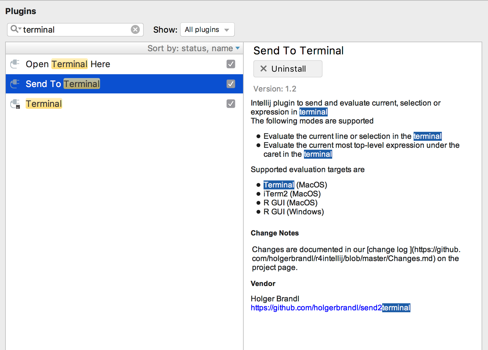

ongoing ide annoyances


## data vis

com.twosigma.beakerx.chart.xychart.Plot;


## examples


```r
require(dplyr)
require(stringr)
require(tidyr)

df = frame_data(
~ x,
"num_classes=10,batch_size=32,version=1,n=3,epochs=200,data_augmentation=True,subtract_pixel_mean=True,checkpoint_epochs=False",
"num_classes=11,batch_size=33,version=3,n=4,epochs=200,data_augmentation=True,subtract_pixel_mean=True,checkpoint_epochs=False"
)

mutate(df, pairs = str_split(x, ",")) %>%
    unnest(pairs) %>%
    separate(pairs, c("key", "value"), sep = "=") %>%
    spread(key, value)

```


---
### too many methods in namespace

https://blog.kotlin-academy.com/effective-java-in-kotlin-item-1-consider-static-factory-methods-instead-of-constructors-8d0d7b5814b2

> The problem with such solution is that while public top-level functions are available everywhere, it is really easy to litter user IDE tips. The even bigger problem starts when someone is creating top-level functions with names that are not directly pointing that it is not a method.

> Object creation using top-level functions is a perfect choice for small and commonly created objects, like `List` or `Map`, because `listOf(1,2,3)` is simpler and more readable then `List.of(1,2,3)` (even though it looks similar). Although public top-level functions need to be used carefully and deliberately.


--
## Tidy Data


source: http://jules32.github.io/2016-07-12-Oxford/dplyr_tidyr/#2_dplyr_overview


steal from http://holgerbrandl.github.io/krangl/bier_slides_june2016/krangl_intro.html#2


--

Pandas Examples:
https://www.analyticsvidhya.com/blog/2016/01/12-pandas-techniques-python-data-manipulation/


## remark

hide with
```
exclude: true

```


---
background-image: url(images/kotlin_logo.jpg)
background-position: center
background-repeat: no-repeat
background-size: 78%

# Since February 2016

.left-column40[

Kotlin v1.0 released

#### Type Inference
#### Extension Functions
#### Data Classes
#### DSLs in Mind
#### Default Parameters
#### Lives in JVM
#### Scripting Support

]

--

.right-column60[

.right[
Data Science Requirements
## Proper Dependency Model 
## Scales from idea to product 
## Teachable 
## Rapid Prototyping 
]
]

???

somewhen in early 2016 god seemed to have heard our prays, and gave us kotlin.

release day 15.2.

what a beauty!

teachable: less than python or r, but better tooling

So can we build data science libraries with? --> next slide


---
# Just use the Kotlin stdlib == more gym time!?

* `map`, `fold`, `filter`, `reduce` are cool and fun
* Useful IO utilities like `File.readLines()`
* Great string manipulation helpers
* Great collection API
* Grouping API

```kotlin
data class User(val firstName: String?, val lastName: String, 
                val age: Int, val hasSudo: Boolean?)

val users = listOf(User(...), ...)

val groupingBy : Grouping<User, Int> = users.groupingBy { it.age }

groupingBy.eachCount()

users.groupingBy { listOf(it.age, it.hasSudo) }.map{  ... }.fold{ ... }
```

More advanced slicing possible with https://github.com/thomasnield/kotlin-statistics

### Still, not enough to implement DS life cycle!

???

so apart from the amazing language spec, what is in the stdlib for data science

winter is coming --> summer is coming

.. so another year no beachbody

for details see https://kotlinlang.org/api/latest/jvm/stdlib/kotlin.collections/-grouping/


---
# Kotlin Basics Revisited: Function literals

> A _lambda expression_ or an anonymous function is a _function literal_, i.e. a function that is not declared, but passed immediately as an expression.

```kotlin
fun lazyMsg(condition: Boolean, msg: (Date) -> String) {
    if (condition) println(msg(Date()))
}

lazyMsg(true, { occurred -> "huhu + ${occurred}"})
```

--

If a function literal has only _one_ parameter, its declaration may be omitted and its name will be `it`.

```kotlin
lazyMsg(true){ "huhu ${it}" }
lazyMsg(true){ "huhu" } // .. or ignore it
```

--

If the _last_ parameter to a function is a function, and you're passing a lambda expression as the corresponding argument, you can specify it outside of parentheses.

```kotlin
lazyMsg(true){ "huhu ${it}" }
```

???

to make sure that everyone is on same page, here ....

`msg` is supposed to be a function that takes a `Date` argument and returns a value of type `String`.

cool, but kotlin goes even further

`it`: implicit name of a single parameter


For full details see  https://kotlinlang.org/docs/reference/lambdas.html

---
## Build an API with type aliases + extensions + lambdas

Envisioned user API for `krangl`
```kotlin
val newDf   = staff.addColumn("age_plus_3") { it["age"] + 3 }
val otherDF = staff.addColumn("row_number") { rowNumber }
```

--

Behind the scenes
```kotlin
fun DataFrame.addColumn(columnName: String, expression: TableExpression): DataFrame = 
    addColumn(ColumnFormula(columnName, expression))

// typealias TableExpression = DataFrame.(DataFrame) -> Any? // .. in first prototype, now:
typealias TableExpression = ExpressionContext.(ExpressionContext) -> Any?

class ExpressionContext(val df: DataFrame) {
    operator fun get(name: String): DataCol = df[name]

    val rowNumber: List<Int> get() = (1..df.nrow).toList()
}
```

* `it` in examples is instance of `ExpressionContext` proxying the `df`
* Allows to refer with `it` and `this` to expression context


???

user perspective `it` is the df, but it is actually not. Just the relevant bits of it

---
# Receivers in function literals provide scope control

Context specific for completion in IDE


---
# Add columns with `addColumn`

```kotlin
val df: DataFrame = dataFrameOf(
    "first_name", "last_name", "age", "weight")(
    "Max", "Doe", 23, 55,
    "Franz", "Smith", 23, 88,
    "Horst", "Keanes", 12, 82)

df.addColumn("salary_category") { 3 }             // add constants
df.addColumn("age_3y_later") { it["age"] + 3 }    // do basic column arithmetics

// krangl dataframes are immutable so we need to (re)assign results to preserve changes.
val newDF = df.addColumn("full_name") { it["first_name"] + " " + it["last_name"] }

// krangl overloads  arithmetic operators like + for dataframe-columns
df.addColumn("user_id") { it["last_name"] + "_id" + rowNumber }

//and provides convenience methods to ignore NAs
df.addColumn("first_name_initial") { it["first_name"].map<String>{ it.first() } }

// or add multiple columns at once
df.addColumns(
    "age_plus3" to { it["age"] + 3 },
    "initial" to { it["first_name"].map<String> { it.first() } }
)
```

---
# Get your data in order with `sortedBy`

```kotlin
df.sortedBy("age")

// and add secondary sorting attributes as varargs
df.sortedBy("age", "weight")

// reverse sorting order
df.sortedByDescending("age")
df.sortedBy{ desc("age") }

// sort descending by age, and resolve ties by weight
df.sortedBy({ desc(it["age"]) }, { it["weight"] })


// sort with indicator lambda
df.sortedBy { it["weight"].round() }
```

???

mimic Kotlin stdlib where possible


---
# Subset variables with `select`

```kotlin
// positive selection
df.select("last_name", "weight")    

// negative selection
df.remove("weight", "age")  

// selector mini-language
df.select { endsWith("name") }   
df.select { matches("foo[0-9") }

// functional style column selection
// odd name to avoid JVM signature clash (help welcome!)
df.select2 { it is IntCol } 

// rename columns
df.rename("last_name" to "Nachname")
```

---
# Subset your records with `filter`

```kotlin
// Subset rows with vectorized filter
df.filter { it["age"] eq 23 }
df.filter { it["weight"] gt 50 }
df.filter({ it["last_name"].isMatching { startsWith("Do")  }})

```

In case vectorized operations are not possible or available we can also filter tables by row which allows for scalar operators
```kotlin
df.filterByRow { it["age"] as Int > 5 }
df.filterByRow { (it["age"] as Int).rem(10) == 0 } // "round" birthdays :-)

```

---
# Summarize your data with `summarize`

```kotlin
// do simple cross tabulations
df.count("age", "last_name")

// ... or calculate single summary statistic
df.summarize("mean_age") { it["age"].mean(true) }

// ... or multiple summary statistics
df.summarize(
    "min_age" to { it["age"].min() },
    "max_age" to { it["age"].max() }
)

// for sake of r and python transition you can also use `=` here
df.summarize(
    "min_age" `=` { it["age"].min() },
    "max_age" `=` { it["age"].max() }
)
```
---
# Perform grouped operations after `groupBy`


```kotlin
val groupedDf: DataFrame = df.groupBy("age") 
// ... or provide multiple grouping attributes with varargs

val sumDF = groupedDf.summarize(
    "mean_weight" to { it["weight"].mean(removeNA = true) },
    "num_persons" to { nrow }
)

// Optionally ungroup the data
sumDF.ungroup()
```


---
# Example: Data Ingestion with `krangl`

```kotlin
dataFrameOf("user")("brandl,holger,37")
        .apply { print() }
        .separate("user", listOf("last_name", "first_name","age"), convert = true)
        .apply { print() }
        .apply { glimpse() }
```

```
            user
brandl,holger,37
```
-----
```
last_name   first_name   age
   brandl       holger    37
```
-----
```
DataFrame with 1 observations
last_name  : [Str]	, [brandl]
first_name : [Str]	, [holger]
age        : [Int]	, [37]
```


---
# Bumpy API corners

#### Lists in table formulas cause operator confusion

```kotlin
users.addColumn("age_plus_3") { it["user"].map<User> { it.age } + 3 } // extend list with 3
users.addColumn("age_plus_3") { it["user"].map<User> { it.age + 3 } } // correct
users.addColumn("age_plus_3") { it["age"] + 3 }   // works because `DataCol.plus` can be defined
```

--
#### Incomplete vectorization for operators

Some (`+`, `-`, `*`, `!`) can be overridden for collections, but others cannot (e.g. all arithmetic and boolean comparison ops)

No vectorization for `>`,  `&&` `==`, etc. in table forumlas → Use function calls or not so pretty `gt`, `AND`, `eq`, etc.


--
#### Receiver vs parameter functions vs properties

How to write vector utilties?

```
dataFrame.summarize("mean_salary") { mean(it["salaray"]) }    // function parameter 
dataFrame.summarize("mean_salary") { it["salaray"].mean() }   // extension/member function
dataFrame.summarize("mean_salary") { it["salaray"].mean }     // extension property
```

???

Don't overload `operator Any?.plus` --> Confusion

https://kotlinlang.org/docs/reference/operator-overloading.html


---

background-image: url(images/push_to_repl.png)
background-position: bottom
background-size: 95%

# How to send code to from IDE to `kshell`?

---
# Using the plugin "Send to Terminal"

.left-column60[
https://github.com/holgerbrandl/send2terminal

* Send current line or selection (default shortcut `meta alt ENTER`)

* Send current and move focus to next line with expression (default shortcut `meta alt shift ENTER`)


Kotlin aware expression detection + automatic imports

Auto-jump to next expression

Also works for great for python, R & bash and anything else in Intellij.

Just works well on MacOS :-(
]

.right-column40[



]


---
# Type support - Part 3: Let krangl define the schema


Infer a schema with

```kotlin
irisData.printDataClassSchema("Iris")
```
which makes krangl to __print__ the Kotlin data class schema for data frame:

```kotlin
data class Iris(val sepalLength: Double, val sepalWidth: Double, val petalLength: Double, 
                val petalWidth: Double, val species: String)
                
val records: Iterable<Iris> = irisData.rowsAs<Iris>()
```

Paste it back into workflow code and continue with typed objects!

```kotlin
records.take(1)
```

```
[ Iris(sepalLength=5.1, sepalWidth=3.5, petalLength=1.4, petalWidth=0.2, species=setosa) ]
```

???

grand finale

applicable for interactive workflow only

---
# Use Object Columns for `Any`thing

Expand properties of `person` into columns via reflection


```kotlin
data class Person(val name:String, val age:Int)

val persons :Iterable<Person> = listOf(Person("Max", 22), Person("Anna", 23))

val df : DataFrame = dataFrameOf("person")(persons)


var personsDF = df. unfold<Person>("person", keep=true) 
    // unfold<Person>("person", select=listOf("age"))
    
personsDF.schema()   
```

```
DataFrame with 2 observations
person  [Person]  Person(name=Max, age=22), Person(name=Anna, age=23)
age     [Int]     22, 23
name    [Str]     Max, Anna
```

???

similar to `separate()` but for object columns


---
# Regression & Classification: https://github.com/haifengl/smile

* **Classification** Support Vector Machines, Decision Trees, AdaBoost, Gradient Boosting, Random Forest, Logistic Regression, Neural Networks, RBF Networks, Maximum Entropy Classifier, KNN, Naïve Bayesian, Fisher/Linear/Quadratic/Regularized Discriminant Analysis.

* **Regression** Support Vector Regression, Gaussian Process, Regression Trees, Gradient Boosting, Random Forest, RBF Networks, OLS, LASSO, Ridge Regression.

* **Feature Selection** Genetic Algorithm based Feature Selection, Ensemble Learning based Feature Selection, Signal Noise ratio, Sum Squares ratio.

* **Clustering** BIRCH, CLARANS, DBScan, DENCLUE, Deterministic Annealing, K-Means, X-Means, G-Means, Neural Gas, Growing Neural Gas, Hierarchical Clustering, Sequential Information Bottleneck, Self-Organizing Maps, Spectral Clustering, Minimum Entropy Clustering.

* **Manifold learning** IsoMap, LLE, Laplacian Eigenmap, t-SNE, PCA, Kernel PCA, Probabilistic PCA, GHA, Random Projection, MDS

* **Nearest Neighbor Search** BK-Tree, Cover Tree, KD-Tree, LSH.

* **Sequence Learning** Hidden Markov Model, Conditional Random Field.

* **Natural Language Processing** Tokenizer, Keyword Extractor, Stemmer, POS Tagging, Relevance Ranking

???


https://deeplearning4j.org/

kotlin examples

https://github.com/deeplearning4j/dl4j-examples/blob/master/dl4j-examples/src/main/kotlin/org/deeplearning4j/examples/feedforward/mnist/MLPMnistSingleLayerExample.kt


---
exclude: true

<a href="./krangl_example_report.html" rel="some text"></a>


???

Feels like the holy grail for reproducible research. Strict dependency model, literate programming, amazing modern language. Let's go for it!

What do we need is coding environment! Next 20 slides, VIMs kotlin language pack, 10 build sources, 10 installation process.

... Kidding:


---
exclude: true

```kotlin
//' ## Flowers Analysis

//' The iris flower
//' 

@file:MavenRepository("bintray-plugins","http://jcenter.bintray.com")
@file:DependsOnMaven("de.mpicbg.scicomp:krangl:0.7")

import krangl.*


//' The first records in the input data (which is bundled with krangl) are
irisData

//' The structure of the input data is
irisData.glimpse()

//' Calculate mean petal
val summarizeDf: DataFrame = irisData
    .groupBy("Species")
    .summarize("mean_petal_width") { it["Petal.Width"].mean() }

//' Print the summarized data
summarizeDf.print()

//' Conclusion: Iris flowers of species _virginica_ have on average the largest petal width.
```

---
# Example: Reshape Tables from Wide To Long

```kotlin
val climate = dataFrameOf(
        "city", "coast_distance", "1995", "2000", "2005")(
        "Dresden", 400, 343, 252, 423,
        "Frankfurt", 534, 534, 435, 913)
```

```
     city   coast_distance   1995   2000   2005
  Dresden              400    343    252    423
Frankfurt              534    534    435    913
```

```kotlin
climate. gather("year", "rainfall", columns = { matches("[0-9]*")} )
```

```
     city   coast_distance   year   rainfall
  Dresden              400   1995        343
Frankfurt              534   1995        534
  Dresden              400   2000        252
Frankfurt              534   2000        435
  Dresden              400   2005        423
Frankfurt              534   2005        913
```

???

`colummns` use function literals again, with column names type as receiver
