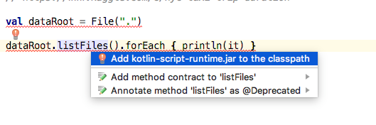

## Presentation Guide

for actual presentation see [slides](./docs/
Welcome Slides

---


New Project


Go to kaggle -NYC --> kernel --> no koltlin --> sad --> change it (what if not at kotlinconfi with all us experts in one room)

stay tuned for the next 12h hours --> just 4 min

we need data --> desktop


new project --> declare dependencies

create shell (launcher needed) **TODO** kshell_from_script should fail if arg is missing

meta+new --> search for script
foo.kts
```
// Challenge: Predict taxi trip duration in NYC

// https://www.kaggle.com/c/nyc-taxi-trip-duration
```


List files --> add scripting support

not first class citizen?

write in one piece and run it --> NO

REPL --> not functional/practical --> slide later

do we need to stop here -->

**TODO** how to bring up kshell --> https://github.com/khud/sparklin --> **TODO**   little kscript with takes gradle and spins up shell


load data and peek into structure

**TODO** krangl columns should have nicer toString

define column names fields

**TODO**  needed configure column width for krangl

eda

**TODO** we need documenation for all central verbs used in the demo

bring in weather (if possible via kafka)

build feature matrix

build model

assess model performance

ship script to kaggle --> no report --> https://github.com/ligee/kotlin-jupyter
render report **TODO** we need more condensed script wrapper


one hot? https://github.com/haifengl/smile/issues/128

slides


## presentation notes

prepare browser instance with all tabs being open already (**TODO** bookmark set!)
