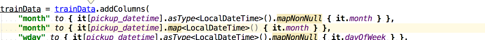

## Feedback

* use just nyc for examples
* incrementally do interactive stuff
* cut away tech-slides (just mention them)
* jupyter before converter **{done}**

## ToDo

* Extend send-to-console to autopush new imports (disabled by default) **{done}**
* Simple kscript plugin for dependency sync **{done}**

* send to expression detect and paste mode console should work in `kts` files
* Fix travis for kravis
* purge import buffer for send-to-console hotykey

* provide more row-iterator api in krangl (see https://haifengl.github.io/smile/data.html_
Kotlin Stack for Data Science
=============================

<br />


https://www.kaggle.com/c/google-analytics-customer-revenue-prediction/?utm_medium=email&utm_source=intercom&utm_campaign=comp-launch-20180912

https://medium.com/@maxsiani/tackling-a-problem-with-machine-learning-6f4650cf80a9

1.5 lm workflow

1h krangl io

How to change column width (screen will need bigger font size

* Fix shaded it in krangl



* column should have more useful toString `weatherData["date"]`

* expression context should expose rows for simplified rowwise operations
* `java.lang.IllegalArgumentException: not all selected columns (date, rain, s_fall, all_precip, has_snow, has_rain, s_depth, max_temp, min_temp)are contained in table
` ja which one then?
* **krangl** allow different join column names


## explore
* https://plot.ly/scala/
* explore tablesaw + vis api
* jOOQ


* execute in built-in terminal https://youtrack.jetbrains.com/issue/IDEA-131964


# Slides

## API nice examples pointers

boolean signature in matching fun
```
df.select(CLUSTER_NUM, CLUSTER_DESC).distinct().filter{ it[CLUSTER_DESC].isMatching { isNotBlank() }}
```

# Tutorial

nice `gtb.importance().zip(trainingData.names).asDataFrame()`


## Questions

* reimpl of jupyter integration (See widget ticket)
* refac for `listOf(1, 2, 3).map { it + 3 }.map { "no$it" }.forEach { println(it) }` --> refac including arg and change to extension in next step

